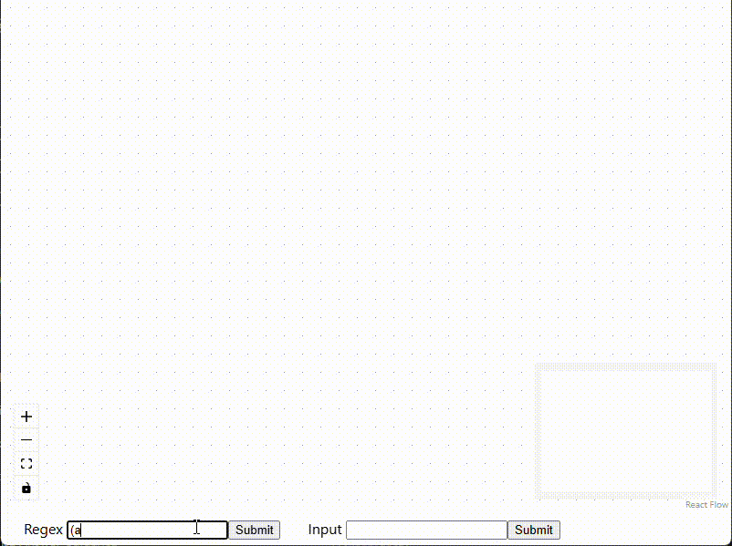
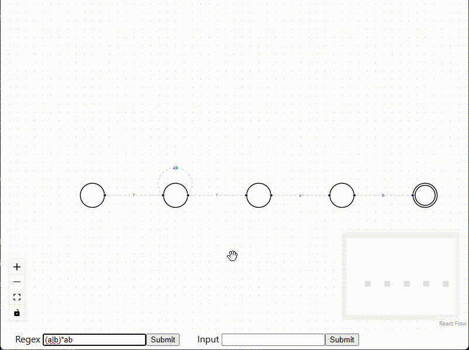

# Regex to NFA

A project that parses regular expressions, converts them into nondeterministic finite automata, and simulates the resulting automata against an input string.

The project is a practical exploration of the relationship between regular expressions and NFAs, building on my understanding of automata theory from university.

Regex Construction Demo:

Input Processing Demo:

## How it works

1. Parser

Converts a regular expression into an Abstract Syntax Tree using Recursive Descent, the algorithm for which is based on [Matt Might's article](https://matt.might.net/articles/parsing-regex-with-recursive-descent/).

2. AST

Contains nodes representing operations indicated by the RegEx grammar. The types are:

Literal - represents characters
Concatenation - represents concatenation, e.g. ab
Union - represents unions, e.g. a|b
Star - represents star operations, e.g. a*

The NFA builder class then contains a method to traverse this tree recursively.

3. NFA Construction

The AST is converted to an NFA using [Jules Jacob's construction](https://julesjacobs.com/notes/nfa/nfa.pdf), which seemed to be simpler to implement than the traditional Thompson's construction.

The add() function is the main operation which gets called recursively to insert the relevant states and transitions for each operation node in the AST, the rules are detailed in the link from above.

4. NFA Representation

The NFA structure is based on [Sipser's book](https://math.mit.edu/~sipser/book.html). It consists of a collection of states, a start and accept state, character transitions, and epsilon transitions.

The NFA is simulated by the NFASim class, which uses non determinism to track each possible path that can be traversed given an input, and checks at the end to see if any path ends at the accepting state.

5. Frontend

The graphical frontend was built using React and React Flow. It provides an interactive visual representation of the NFA generated, with states and transitions displayed and movable. 

It allows user input for a regex to be converted to an NFA and displayed, and an input string to be processed by some constructed NFA.

Tauri provides the desktop application layer using Rust to communicate with the Java backend which runs as a JAR and communicated via input/output streams using JSON.

## Running the Project

**Requirements**

- Java 21 or later (must be available on system PATH)
- Windows (other operating system installers to be added)

**Running the app**

Run the .msi or .exe installer and once complete, run the app's executable. 

Note: For myself, Windows seemed to block the installation process or block the running of the application, so you may have to disable Smart App Control in Windows Security, but this can be re-enabled later.